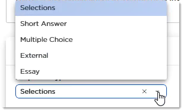

# CEP 2002: Knowledge Check Type Requirements

## Abstract

This CEP documents the semantics, syntax and conventions associated with the three "response types" used in instructional and challenge modules.

## Rationale

The aim of this CEP is to standardize rules and guidelines for the various types of knowledge check tasks. Obeying this CEP is important for maintaining consistency and integrity of knowledge checks across the content spectrum.  

## Specification

### What is a “Response Type”

A knowledge check type refers to the **Response Type** selected in the Action part of a question task in the SimSpace Portal.

Eventually, certain aspects of this standard will be able to be validated by a program, and the author will be presented with an error or a warning. As of June 2020, this is not the case. You should still adhere to the standard to eliminate issues with backward compatibility.

### Response Type Options:

*  Selections
*  Short Answer
*  Multiple Choice
*  External
*  Essay

 

For instructional and challenge modules, use only Selections, Short Answer and Multiple Choice. Essay is used for candidate assessment modules. External is an artifact, and is no longer required.

In the parlance of training and test questions, the "stem" is the question/activity/assignment/problem that the student must respond to.

For all response types, avoid stems that use negative construction. An example would be: "Select the option that is not part of such-and-such." Using such construction requires the student to focus on the mechanics of the knowledge check instead of the actual topic. 

Avoid trying to trick the user. Avoid distracting the user with unnecessary information or details, especially when a stem involves a scenario. These tactics can lead to a lack of trust and reduce your credibility.

Do not use knowledge checks with true or false options. Multiple Choice types require a minimum of four options, so true/false construction will be flagged as an error.

#### Type: Selections

Use Selections when you want the student to select more than one option as correct. (If there is one correct option, use the Multiple Choice type.)

The student must select the _precise_ _combination_ of options in order for the response to be correct.

As of June 2020: If at least one of the selected options is incorrect, **all** selected options display with a red "X". If the student is able to do a retry, they must deselect the incorrect option(s). The correct options can remain selected. They may also need to select additional options not previously chosen.

As of June 2020, add the note below to all knowledge checks that use the Selections response type:

_NOTE: If the combination of selections is incorrect, the attempt is marked incorrect. If attempts remain, modify your selections and Retry._

#### Type: Multiple Choice

Use Multiple Choice when there is one correct answer.

Include 4-6 options. All options should be plausible. In other words, do not include options that are ridiculously incorrect.

Do not use "none" or "all" types of options, such as "none of the above". 

If the answer is used to complete a sentence, the missing word or phrase should be at the end of the sentence. A fill-in that occurs in the middle requires the student to focus their cognitive efforts on the mechanics of the stem, and not the content.

#### Type: Short Answer

In Short Answer response types, the student must enter a value, word or phrase.

Short Answer requires exactness and is therefore unforgiving. If the correct answer could be provided using upper or lower case letters, you  need to enter alternative answers in different case modes. One way to avoid this is to specify the case mode the student should use. Similarly, certain numeric values with more than three digits could be expressed with a comma. Also be careful of answers that could be considered correct when used with or without spaces, dashes or other punctuation. For these reasons, provide an example of the format or syntax of the answer.

Sample instructional for responding to a short-answer:  
Enter the three-letter domain type of the malicious actor.  
(For example: .edu)

### Requirements

* "Selections" type must have a minimum of two correct answers.
* "Selections" type must have an italicized note that reads:
    * NOTE: If the combination of selections is incorrect, a red X displays on all selections, including those that are correct.
*    "Multiple Choice" type must have a minimum of four answer options.
*    "Short Answer" type must provide answer format information.
*    "Short Answer" type must provide an answer example.

## References and Footnotes

