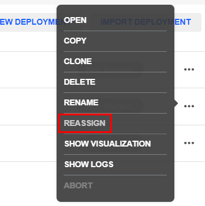

# CEP 2040: Network Specification Best Practice

## Abstract
This CEP details best practice for the design and implementation of clone sources and clone sources. Specifically, it outlines the requirement to deconflict clone sources and clone sources to avoid having too many clone sources nested in a single clone source. It also sets the best practice of having each content module have a one-to-one relationship between clone sources and clone sources. It also codifies Range Minimization and gives guidelines on how to reduce the number of unnecessary VMs and Subnets in a given range.

## Rationale

### content module - clone source - clone source Deconfliction
Best practice has shown that for any given content module, a single clone source with one attached clone source is the ideal setup. This mitigates many problems with clone sources and clone sources, including limiting the number of possible clone sources for the module, limiting the effect of changing the clone source and unintentionally changing a clone source for a different deployment, and keeping clone sources organized.

While it may be necessary to have backup clone sources from time to time, the author of a given module should make every effort to reduce the number of clone sources that are kept in any given clone source to a single clone source. This is especially true for instructional modules where the clone source has been finalized and attached.

To ensure that Module <-> clone source <-> clone source remains a one-to-one-to-one relationship, ensure that new ranges are forked from existing ranges into their own separate clone source via the 'Reassign' feature. This workflow could look like the following:

 1. author identifies a good base clone source that would be useful for a new module.
 2. author goes into the existing clone source for that module and creates a deployment from that module's clone source.
 3. author clicks the ellipses button next to the new deployment and selects `Reassign` (pictured below)
4. author creates a separate clone source for this new range build.

 
 ### Range Minimization
 HardHat ranges utilize some auxiliary services in order to rapidly create networks. These services are deployed from specially configured VM templates and provide DHCP, puppet configuration, and other kinds of range creation services. After range creation is completed, these services are no longer needed within the deployment.
 
 During range finalization and minimization, the author will ensure that the final clone source that is attached to any given content module does not include the extra range management VMs. This can include, but is not limited to:
 * simspace-mgmt
 * control-dhcp
 * nagios
 * range-transfer

It is important to note that simply removing the range management VMs and VM Templates from the clone source may have unintended side-effects. A better way to minimize the range is to uncheck these VMs during deployment of the finalized clone source.

To ensure the listed VMs are not deployed with the final clone source, the following workflow may be used:
1. Using a given clone source, create a new deployment with the latest version of the clone source.
2. Click `Open` to open the deployment options.
3. In the second tab, `Review Deployment`, uncheck all boxes next to the range management VMs.
4. Continue to create the deployment and build the range.
5. (Optional) Before finalizing the new clone source, this is a good time to check all functionality of the clone source, check the artifacts, clean the VMs for finalization, etc.
6. Shut down the new deployment and create a new clone source. This new clone source will not deploy any of the range management VMs. Reattach this new clone source to the content module and ensure all VMs are re-added to the VM Access Panel.

### Range Subnets
Generally speaking, the number of Subnets in the clone source should match the number of subnets that are used in the range. The author will make effort to reduce the number of subnets down to the ones that are utilized. The author will make special effort to ensure the Real-Internet subnet, if used during the range testing and development, is removed prior to clone source minimization and finalization.

### Requirements
   * Each content module will have a one-to-one relationship with a clone source. All new content modules will have their own dedicated clone source.
   * Reuse of an existing clone source for multiple ranges is acceptable, either as a starting point or as a final range, provided the clone source is deployed and reassigned into its own clone source.
   * Authors will make effort to reduce the number of clone sources in any given clone source to a minimum. During the test and development process, multiple clone sources may be necessary. After a content module is finalized and the range has been attached, the author will reduce the number of clone sources as much as is appropriate. 
   * When finalizing and minimizing a range for a content module, the author will ensure that the auxiliary VMs (simspace-mgmt, range-transfer, control-dhcp, etc) are not deployed in the clone source that is attached to the content module. See above for a workflow for this process.
   * The author will ensure the number of Subnets in the clone source is reduced to the minimum necessary for use in the range.
   * The author will make special effort to remove the Real-Internet subnet if it was used during development prior to range minimization.

## References and Footnotes

